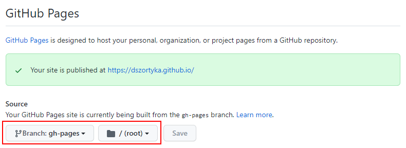

# Getting started with GitHub Pages

Nowadays, most of companies tend to use private git repositories. This means that most of our work keeps restrict to internal public. That's fine, that's ok.

The idea of having a personnal GitHub Page is to provide comments on IT Topics, tools and the challenges faced every week.

As part of this process, I created this GitHub page and had to start with the basics: **Setup a GitHub Page**.


## Setting up GitHub Pages

The instructions are pretty straight forward... The problem? 

My understanding from **Mkdocs** is that the source content will be located in the **Main** branch and inside the **/docs** folder. 

As we can see from the image below, the text says:
```
Source: Your GitHub Pages site is currently built from the <name> branch
```

My understand is that this option should be set to "Main" branch and /docs folder. **But it is NOT!**

**gh-pages** branch and **/ (root)** folder needs to be selected. **Reference** links below provide more information. 





## Reference Links

[GitHub Pages](https://docs.github.com/en/pages/quickstart)

[GitHub MkDocs Deploy Action](https://github.com/marketplace/actions/deploy-mkdocs)

[Mkdocs Material](https://squidfunk.github.io/mkdocs-material/publishing-your-site/)

[Material for Mkdocs](https://squidfunk.github.io/mkdocs-material/)

[https://github.com/mkdocs/mkdocs/issues/2255#issuecomment-922165394](https://github.com/mkdocs/mkdocs/issues/2255#issuecomment-922165394)

[https://github.com/mkdocs/mkdocs/discussions/2569](https://github.com/mkdocs/mkdocs/discussions/2569)
